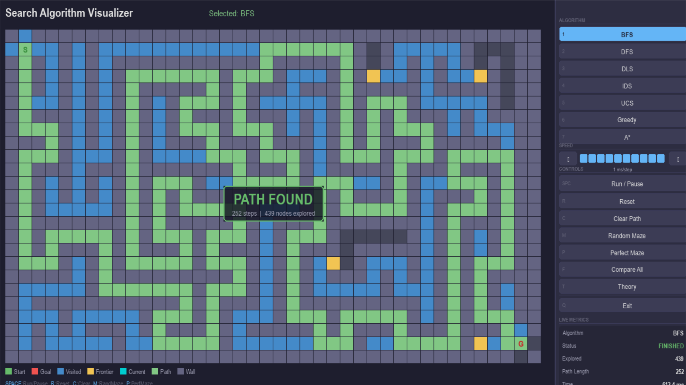

# Search Algorithm Visualizer

An interactive platform for visualizing and comparing graph search algorithms in real time.



---

## Quick Start

### Windows (Double-click)

1. Clone the repository
2. Double-click `install.bat` — installs dependencies (first time only)
3. Double-click `start.bat` — launches the visualizer

### Command Line

```bash
pip install -r requirements.txt
python main.py
```

### Requirements

- Python 3.8+
- pygame >= 2.5.0

---

## Features

- **7 Search Algorithms** — BFS, DFS, DLS, IDS, UCS, Greedy Best-First, A*
- **Interactive Visualization** — Watch algorithms explore the grid step-by-step
- **Real-time Metrics** — Track nodes explored, path length, and execution time
- **Speed Control** — 10 speed levels from slow-motion to near-instant
- **Wall Drawing** — Click and drag to draw/erase walls interactively
- **Maze Generation** — Random obstacles or perfect recursive-backtracker mazes
- **Comparison Mode** — Run all 7 algorithms instantly and compare results
- **Theory Overlay** — Educational panel with complexity, completeness, and key ideas
- **Keyboard Shortcuts** — Full keyboard control for fast interaction

---

## Demo

[▶ Watch Demo Video](Screen%20Recording.mp4)

---

## Supported Algorithms

| Algorithm | Complete | Optimal | Time Complexity | Space Complexity |
|-----------|-----------|---------|-----------------|------------------|
| BFS | Yes | Yes (unweighted) | O(b^d) | O(b^d) |
| DFS | No | No | O(b^m) | O(bm) |
| DLS | No | No | O(b^l) | O(bl) |
| IDS | Yes | Yes (unweighted) | O(b^d) | O(bd) |
| UCS | Yes | Yes | O(b^(C*/e)) | O(b^(C*/e)) |
| Greedy | No | No | O(b^m) | O(b^m) |
| A* | Yes | Yes (admissible h) | O(b^d) | O(b^d) |

> b = branching factor, d = depth of shallowest goal, m = maximum depth, l = depth limit, C* = cost of optimal solution, e = minimum edge cost

---

## Controls

### Keyboard Shortcuts

| Key | Action |
|---|---|
| `SPACE` | Run / Pause algorithm |
| `R` | Reset grid (clear all) |
| `C` | Clear path (keep walls) |
| `M` | Generate random maze |
| `P` | Generate perfect maze (recursive backtracker) |
| `F` | Compare all 7 algorithms instantly |
| `T` | Toggle theory overlay for selected algorithm |
| `ESC` | Close theory overlay |
| `Q` | Exit application |
| `1` – `7` | Select algorithm (BFS → DFS → DLS → IDS → UCS → Greedy → A*) |
| `S` + drag | Move the Start node |
| `G` + drag | Move the Goal node |

### Mouse Controls

| Action | Effect |
|---|---|
| Left-click drag on grid | Draw walls |
| Right-click drag on grid | Erase walls |
| Click sidebar buttons | Select algorithm, control speed, run actions, exit |

---

## Architecture

```
search_visualizer/
├── __init__.py     Package declaration
├── grid.py         Grid data structure + maze generators
├── algorithms.py   7 search algorithms as step-by-step generators
├── renderer.py     Pygame rendering engine + color scheme
├── theory.py       Algorithm metadata (complexity, completeness)
└── ui.py           Sidebar panel, buttons, metrics, theory overlay

main.py             App loop, event handling, state machine
```

---

## Team Project

This project was developed collaboratively as part of a university AI/search algorithms course (AIE111 — Artificial Intelligence).

The visualizer demonstrates practical implementation of graph search algorithms with emphasis on:
- Algorithm behavior visualization
- Performance comparison
- Educational clarity
- Clean software architecture

---

### Author
* **Mark Amgad Nassief Botros Mekhaiel**
  * *Artificial Intelligence Engineering Student*
  * *Faculty of Computer Science and Engineering*
  * *New Mansoura University*